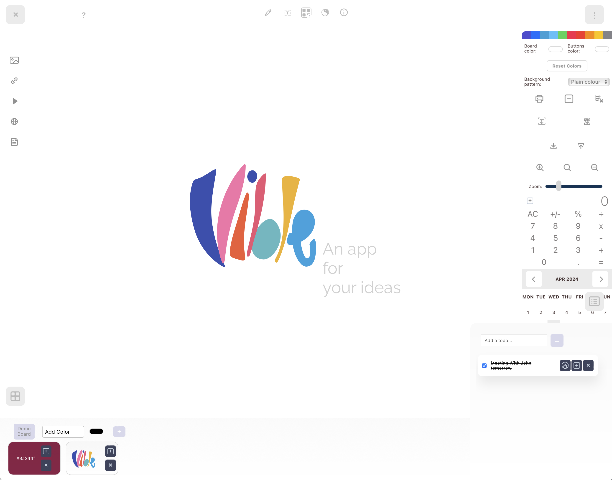
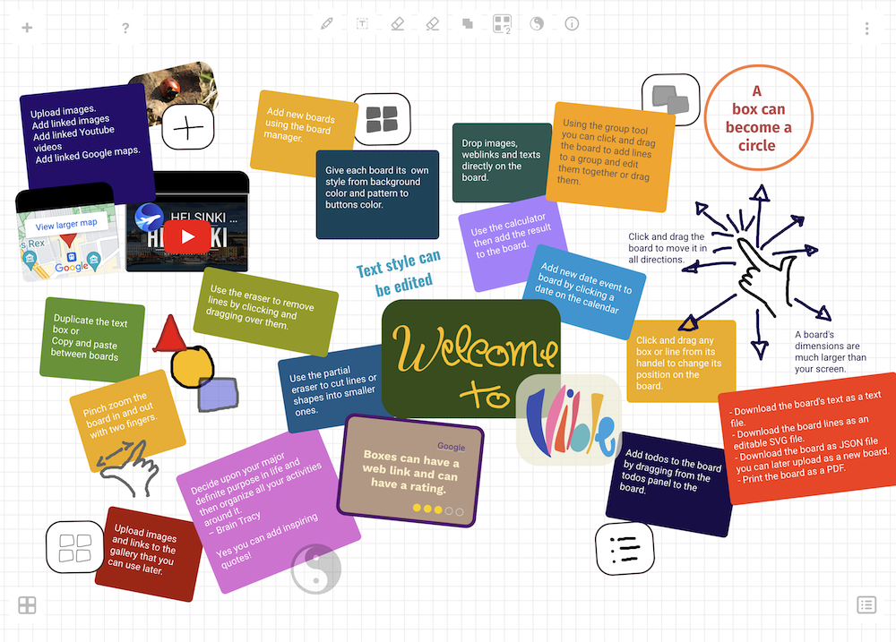

# Vible

## A note taking app where you can grow and organise your ideas

[Online Demo](https://vible.netlify.app)

### Built with React

### `npm install`

### `npm start`

Runs the app in the development mode.\
Open [http://localhost:3000](http://localhost:3000) to view it in your browser.

- It is recommended to use the Chrome web browser for a better overall experience.

- You get access to the documentation using the (?) button at the top.

- You can load a demo board with instructions by clicking the "Demo Board" button in the "Gallery" panel at the bottom.

- The interface has four main panels:

  - "Add items" at the left
  - "Controls and Utilities" at at the right
  - "Gallery" at the bottom left
  - "To do list" at the bottom right

- At the top are the "Documentation", the "Tool box", the "Board manager", "Random inspirational quotes" and "Info popups"

- Vible stores anything you drop on it in the browser LocalStore memory and in the browser IndexedDb, no external database is accessed so your board data lives only on the browser you use it on and will stay there as long as you don't erase it.

- Everything you add to the board is automatically saved and all changes are applied and saved instantly.

- Mix vector freeform drawings and handwriting with typed text, uploaded images, linked images, Youtube videos, Google maps and Pdf files.

- You can create multiple boards and manage them using the Board manager.

- Cutomise each Board using the theme editor in the right panel.

- Boards can be printed and downloaded as a Pdf file.

- Boards can also be saved in Json format for backup, sharing or transfer.

- The left "Add items" panel shows forms to upload or embed images, videos, maps and pdf files

- Select text from web pages or applications windows an drag it to the board.

- Select and drag a youtube or a google maps (https://www.google.com/maps/...) link from the address bar and drop it anywhere on the board to embed the video.

- Select and drag an image from a web page to the board and it will show on the board. Not all images can be linked to unfortunately.

- Click a calendar date to get a box with the date on the board.

- Write todos, drag them to reorder them. Edit them, or mark them as completed.

- You can also drag todos to the board and expand on them.

- Clicking on the board will stop editing operations.

- Clicking and dragging the board background will move it in all directions.

- To add a text box you can right click with the mouse to see a box appear at the cursor position. You can click the text tool at the top. Added todos, calendar dates, gallery color boxes and web links are all text boxes and can be edited the same way.

- Click any text box to modify its size, angle, color, border width, border color, text content, text color, text alignment, font family, font size, font style and corner roundness.

- Text Boxes can be reordered forward, backwars or brought to the front and sent to the back or duplicate it.
  Show or hide the rating marks at the bottom right.

- You can also add a web link that will show at the top of the box.

- Click a box or an image from any point on it to drag it around.

- Click videos, maps and pdfs from the top bar to drag them around. The actual object can be interacted with.

- The embedded videos, images, maps and pdfs can be resized, rotated and reordered.

- When you hover over any line it will get automatically selectec so you can click it and move it around or edit it.

- All drawn lines will show at the front of other objects, they can be dragged around, resized and rotated, dashed, have arrow heads, turn them into a filled shapes, change their width, their color, their opacity and reorder them or duplicate them.

- To delete a line you can select it and press the delete key on your keyboard or click the delete option on the top form or use theeraser.

- When you double click a box or click the edit board button at the top, an image or the top bar or the other objects you will see a rotation handle on the left side and a resize handle at the bottom right that you can use to directly modify the selected object.

- The selected object will show three control buttons at the top left, the red one is to delete the object and will give you a confirmation warning as it is not reversible. The green button will activate editing for the selected object and the orage button shows when the object is in edit mode, clicking it will stor the editing operation.

- You can use the drag eraser to remove lines or the partial eraser to erase only parts of them.
  When you use the eraser you can undo if you erased something by error.

- With the line group tool at the top one can drag over mutiple lines, their color will become red then you can click one and drag the group around or resize and rotate it or change the line width and color.

- You can change an image opacity to be able to trace over it. Drawn lines are in vector and can be edited later

- You can use the erase board items or the erase all lines button. on the right controls panel.

- On mobile devices you can add Vible to the homescreen and use it as one of you apps.

- There is also a calculator that can come in handy. You can select the result and drag it to the board.

- In the gallery at the bottom you can add color boxes with color code, uplodad images and add web links that will all stay there and can be added later to the board.

- If you delete an object you will get a warning as that operation cannot be undone.

- When you upload a saved board in Json format it will be added to the existing content so be careful to backup the existing content in its own Json file as some lines will be difficult to separate if the overlap.

- You can zoom in and out by clicking or using a slider or using the pinch gesture on a tablet. Zooming out permits to print more of the board content into one page.
